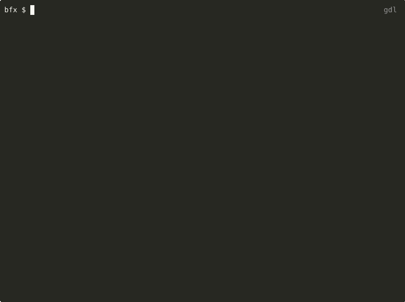

# `gdl` - Genome Download

[](https://github.com/audy/gdl/actions/workflows/rust.yml)

A fast, easy-to-use, command-line tool for downloading genome assemblies from
NCBI GenBank (RefSeq).



## Features

- **Easy Taxonomic Filtering** - Retrieve assemblies at or below a given
  taxonomic name or ID (E.g., "download all assemblies within the order
  _Lactobacillales_")
- **Assembly Metadata Filtering** - Specify genome completeness, source
  (GenBank, RefSeq), format (`.gbk`, `.fna`)
- **Fast** - Re-use connections and process downloads in parallel
- **Portable** - Distributed as a single binary executable

## Examples

```sh
# Download all assemblies within the clade "Dinosauria"
gdl --tax-name Dinosauria

# Download all GenBank genomes within the order Lactobacillales
gdl --tax-name "Lactobacillales" --source genbank

# Download all complete RefSeq assemblies in .gbk format within the genus
# Phocaeicola (tax_id=821)
gdl --tax-id 821 --format gbk --source refseq --assembly-level "Complete Genome"

# Download all Betacoronavirus genomes in GenBank
gdl --tax-name "Betacoronavirus" --format fna --source genbank --out-dir betacoronaviruses/

# Download all Complete viral assemblies from RefSeq
gdl --tax-name "Viruses" --format fna --source refseq --assembly-level "Complete Genome"
```

## Installation

### Homebrew

```bash
brew install audy/tap/gdl
```

### From binary

Binaries are built for macOS, Windows and Linux and are available
[here](https://github.com/audy/gdl/releases)


### From Source

```sh
git clone ...
cargo build --release
(sudo) cp target/release/gdl /usr/local/bin/
```

## Options

### `--help`

Print help and exit.

### `--tax-id <TAX_ID>` / `--tax-name <TAX_NAME>`

Download all assemblies within the provided taxonomic node.

### `--no-children`

Do not download assemblies assigned to tax IDs below the provided taxonoic node.

### `--parallel <PARALLEL>`

Download concurrently in `<PARALLEL>` threads.

### `--format <FORMAT>`

File format to retrieve. The default is `fna`. The possible values are:

- `fna` - fasta nucleotide, genomic
- `faa` - fasta amino acid, coding
- `gbk` - assembly and annotations, genbank format
- `gff` - assembly and annotations, genomic file format

### `--out-dir <OUT_DIR>`

Output directory to store files in. By default, will use `$pwd`. If provided,
the directly must exist prior to running.

### `--source <SOURCE>`

The source from which to retrieve the genomes. Can be either "refseq" or
"genbank" (default=refseq).

### `--assembly-level <ASSEMBLY_LEVEL>`

Filter to only assemblies that match `<ASSEMBLY_LEVEL>`. Default is to include
assemblies with any assembly level value. Possible values are `Contig`,
`Scaffold`, `Complete Genome` and `Chromosome`. For defintions, see [NCBI
documentation](https://www.ncbi.nlm.nih.gov/datasets/docs/v2/glossary/).
